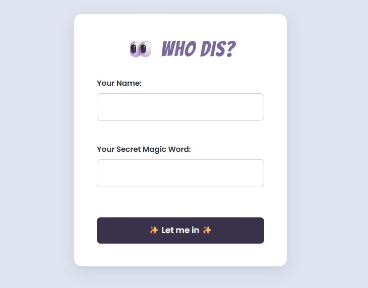
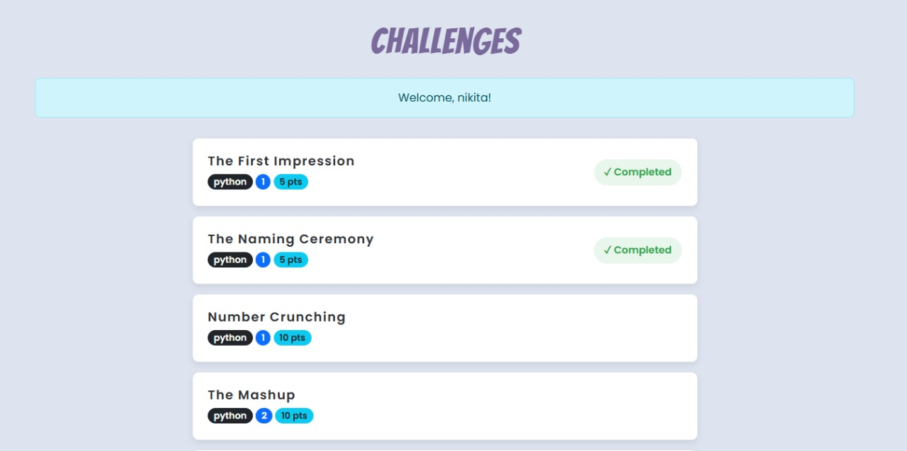
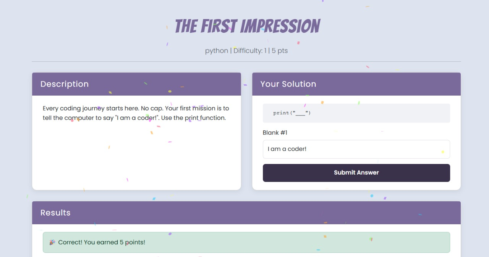

<p align="center">
  
  
  
</p>

> "No lectures. No pressure. Just code, chaos, and a little bit of progress."

## notacoder 🐙

**notacoder** is a chill little coding playground built with Django. It’s for beginners who want to learn Python without sitting through hours of theory videos or pretending to understand what recursion is on day one.

You get bite-sized challenges where you fill in the blanks, hit submit, and maybe celebrate with some confetti. It’s simple, low-stress, and kind of fun (once the code runs).

**Disclaimer:** This project is under construction. Things might look odd, break randomly, or disappear. That’s life. We move.

---

## Features

- **Learn by Doing:** Skip the 50-slide intro. Just open a challenge and start typing.
- **Points & Progress:** Get points for solving stuff. Feels good.
- **Guest Mode:** No sign-ups, no emails, no passwords. Just jump in.
- **Confetti? Yes:** Correct answers get sparkles. Because why not.

---

## Screenshots

### Login Page: Just say who you are

Minimal setup. Name and magic word. That’s it.



---

### Challenge List: Your to-do (but more fun)

A scrollable list of challenges. You’ll see what you’ve finished, and what’s waiting.



---

### Challenge Detail: Where the code happens

Each challenge gives you a little problem. You fill in the missing code. That’s the game.



---

## Tech Stack

- **Backend:** Python 3.12, Django 5.1  
- **Database:** SQLite3 (yes, the classic)  
- **Frontend:** HTML, CSS, some JavaScript  
- **Extras:** Bootstrap 5, Confetti.js for celebrations

---

## Local Setup

Wanna try it out on your machine? Here’s how:

1. **Clone the repo:**
    ```bash
    git clone https://github.com/iamnikitaa/notacoder.git
    cd notacoder
    ```

2. **Set up a virtual environment:**
    ```bash
    python -m venv venv
    source venv/bin/activate  # Windows: venv\Scripts\activate
    ```

3. **Install requirements:**
    ```bash
    pip install -r requirements.txt
    ```

4. **Run migrations:**
    ```bash
    python manage.py migrate
    ```

5. **Add the starter challenges:**
    ```bash
    python manage.py add_challenges
    ```

6. **Start the server:**
    ```bash
    python manage.py runserver
    ```

Now open your browser and go to `http://127.0.0.1:8000`

---

## Roadmap

Things that may or may not happen soon:

- [ ] Add more topics (like APIs, file stuff, maybe a surprise or two)
- [ ] Profiles with stats
- [ ] Leaderboard (because why not)
- [ ] UI glow-up
- [ ] Filters for challenge type/difficulty

---

<p align="center">
  Built with Python, caffeine, and the occasional “why isn’t this working?”
</p>
